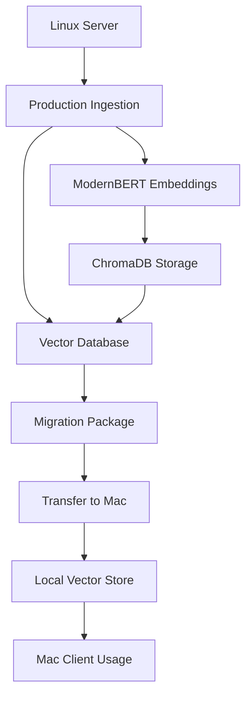

# 🚀 NVIDIA Documentation RAG System

<div align="center">


**Production-Ready Cross-Platform RAG System for NVIDIA Technical Documentation**

*Advanced semantic search and Q&A system with ModernBERT embeddings, optimized for Linux servers and Mac clients*

[🎯 Quick Start](#-quick-start) • [� Deployment](#-deployment) • [🧪 Testing](#-testing) • [📚 Migration](#-migration)

</div>

---

## ✨ What is this?

The **NVIDIA Documentation RAG System** is a production-ready, cross-platform RAG (Retrieval-Augmented Generation) system specifically designed for NVIDIA technical documentation. It features **ModernBERT embeddings**, **seamless vector database migration**, and **optimized deployment** for both Linux servers and Mac clients.

### 🎯 Key Features

- 🧠 **ModernBERT Embeddings** - State-of-the-art 768-dimensional semantic understanding
- 🖥️ **Cross-Platform** - Optimized deployment for Linux servers and Mac M1/M2/M3
- � **Seamless Migration** - One-command vector database packaging and transfer
- ⚡ **Production Optimized** - CUDA acceleration on Linux, Apple Silicon on Mac
- � **Semantic Search** - Superior document retrieval with contextual understanding
- 🛡️ **Robust Pipeline** - Comprehensive error handling and validation
- 📊 **Performance Monitoring** - Detailed metrics and benchmarking
- 🧪 **Fully Tested** - Complete test suite ensuring reliability

### 💡 Perfect For

- **ML Engineers** building production RAG systems
- **DevOps Teams** needing cross-platform deployment
- **Researchers** requiring high-quality embeddings
- **Enterprises** with Linux server + local client workflows
- **AI Teams** working with NVIDIA documentation at scale

---

## 🚀 Quick Start

### Prerequisites
- **Linux Server**: Python 3.10+, 8GB+ RAM, NVIDIA GPU (optional)
- **Mac Client**: macOS, Miniconda/Anaconda, 8GB+ RAM
- **Network**: SSH access between server and client

### 1. Linux Server Setup
```bash
# Clone the repository
git clone https://github.com/debarchan19/nvidia-doc-agent.git
cd nvidia-doc-agent

# Run automated deployment
./deploy_linux.sh

# Prepare your documentation
mkdir nvidia_docs_md
# Copy your NVIDIA documentation files here
```

### 2. Production Ingestion
```bash
# Run production ingestion with ModernBERT
python3 run_production_ingestion.py \
  --docs-root ./nvidia_docs_md \
  --vector-store ./production_vector_store \
  --modernbert-path ./ModernBERT-base

# Create migration package
python3 migrate_vector_db.py package \
  --vector-store ./production_vector_store/vector_store \
  --output ./packages
```

### 3. Mac Client Setup
```bash
# Setup Mac environment
./setup_mac.sh

# Transfer and extract vector database
scp user@server:/path/to/packages/nvidia_vector_db_*.tar.gz ./
python3 migrate_vector_db.py extract \
  --package ./nvidia_vector_db_*.tar.gz \
  --target ./local_vector_store
```

---

## 💡 Architecture & Workflow

### Cross-Platform Deployment Flow


### Key Components
- **🧠 ModernBERT**: 768-dimensional embeddings for superior semantic understanding
- **📊 ChromaDB**: Persistent vector storage with metadata
- **🔄 Migration System**: Seamless cross-platform database transfer
- **⚡ Optimizations**: CUDA on Linux, Apple Silicon on Mac

• **High-Performance Computing**: Multiple NVIDIA GPUs (A100, H100) for parallel processing
• **Optimized Software Stack**: Pre-installed AI frameworks and NVIDIA software
• **Scalable Architecture**: Support for multi-node configurations and clustering
• **Enterprise Features**: Advanced networking, storage, and management capabilities

Sources: dgx-superpod-administration-guide-dgx-a100.pdf.md, enterprise-support-services-user-guide.pdf.md
```

### Programmatic Usage
```python
from rag.main import RagAgent

# Initialize the agent
agent = RagAgent(model_name="llama3.2:3b")

# Ask a question
response = agent.chat("How do I optimize GPU memory usage in CUDA?")
print(response)

# Multiple questions with context
agent.chat("What is CUDA?")
agent.chat("Show me examples of CUDA programming")  # Maintains context
```

---

## 🔧 Installation

### Option 1: Quick Install
```bash
pip install nvidia-docs-rag
```

### Option 2: From Source
```bash
# Clone repository
git clone https://github.com/yourusername/nvidia-docs-rag.git
cd nvidia-docs-rag

# Create virtual environment (recommended)
python -m venv venv
source venv/bin/activate  # On Windows: venv\Scripts\activate

# Install dependencies
pip install -r requirements.txt

# Install in development mode
pip install -e .
```

### Option 3: Using Docker
```bash
# Build the image
docker build -t nvidia-rag .

# Run the container
docker run -it --rm nvidia-rag chat
```

---

## 📖 Usage

### Command Line Interface

```bash
# Start interactive chat
nvidia-rag chat

# Process single query
nvidia-rag query "What is NVIDIA Tensor Core?"

# Check system status
nvidia-rag status

# Run system test
nvidia-rag test

# Use different model
nvidia-rag --model llama3.1:8b chat
```

### Python API

```python
from rag.main import RagAgent
from rag.agent.controller import AgentController

# Method 1: Using RagAgent (LangGraph-based)
agent = RagAgent()
response = agent.chat("What are NVIDIA GPUs used for?")

# Method 2: Using AgentController (Direct control)
controller = AgentController()
result = controller.query("Explain CUDA architecture")
print(result['response'])

# Method 3: Direct tool usage
from rag.agent.tools import search_nvidia_docs

results = search_nvidia_docs.invoke({
    "query": "GPU memory optimization",
    "max_results": 5
})
```

---

## 🏗️ Architecture

```
┌─────────────────┐    ┌──────────────────┐    ┌─────────────────┐
│   User Query    │───▶│   LangGraph      │───▶│   Ollama LLM    │
└─────────────────┘    │   Workflow       │    └─────────────────┘
                       └──────────────────┘             │
                                │                       │
                                ▼                       ▼
┌─────────────────┐    ┌──────────────────┐    ┌─────────────────┐
│  Final Answer   │◀───│  RAG Pipeline    │◀───│  Retrieved Docs │
└─────────────────┘    └──────────────────┘    └─────────────────┘
                                │                       ▲
                                ▼                       │
                       ┌──────────────────┐    ┌─────────────────┐
                       │   Search Tools   │───▶│  ChromaDB       │
                       └──────────────────┘    │  Vector Store   │
                                               └─────────────────┘
```

### Components

- **LangGraph Workflow**: Orchestrates the RAG pipeline with conditional edges
- **Ollama Integration**: Local LLM inference without API dependencies  
- **ChromaDB Vector Store**: Efficient similarity search over 4,800+ documents
- **Smart Retrieval**: Context-aware document retrieval with relevance scoring
- **Citation System**: Automatic source attribution for all answers


## 🛠️ Configuration

### Environment Variables
```bash
# Optional: Set custom paths
export NVIDIA_DOCS_ROOT="/path/to/nvidia/docs"
export NVIDIA_VECTOR_STORE_DIR="/path/to/vector/store"
```

### Custom Models
```python
# Use different Ollama models
agent = RagAgent(model_name="llama3.1:8b")  # More capable
agent = RagAgent(model_name="llama3.2:1b")  # Faster/smaller
```

### Advanced Configuration
```python
from rag.pipeline.retrieve import Retriever

# Custom retriever settings
retriever = Retriever(
    top_k=10,           # More results
    max_distance=1.5    # Stricter relevance
)
```

---

## 📚 Documentation Topics Covered

The system includes comprehensive documentation on:

- **GPU Architecture**: NVIDIA GPU designs, specifications, and capabilities
- **CUDA Programming**: Development guides, APIs, and best practices  
- **DGX Systems**: Administration, deployment, and management
- **Networking**: InfiniBand, Ethernet, and interconnect technologies
- **AI Frameworks**: TensorRT, cuDNN, and acceleration libraries
- **Driver & Firmware**: Installation, configuration, and updates
- **Enterprise Solutions**: Deployment guides and enterprise features


## 🤝 Contributing

We welcome contributions! Here's how to get started:

1. **Fork** the repository
2. **Create** a feature branch: `git checkout -b feature-name`
3. **Make** your changes and add tests
4. **Run** tests: `pytest`
5. **Submit** a pull request

### Development Setup
```bash
# Clone and setup development environment
git clone https://github.com/yourusername/nvidia-docs-rag.git
cd nvidia-docs-rag

# Install in development mode
pip install -e ".[dev]"

# Run tests
pytest

# Format code
black rag/
```


## 🙋‍♂️ Support

- 📖 **Documentation**: Check this README and code comments
- 🐛 **Issues**: [GitHub Issues](https://github.com/yourusername/nvidia-docs-rag/issues)
- 💬 **Discussions**: [GitHub Discussions](https://github.com/yourusername/nvidia-docs-rag/discussions)
- 📧 **Contact**: your.email@example.com


<div align="center">


</div>
